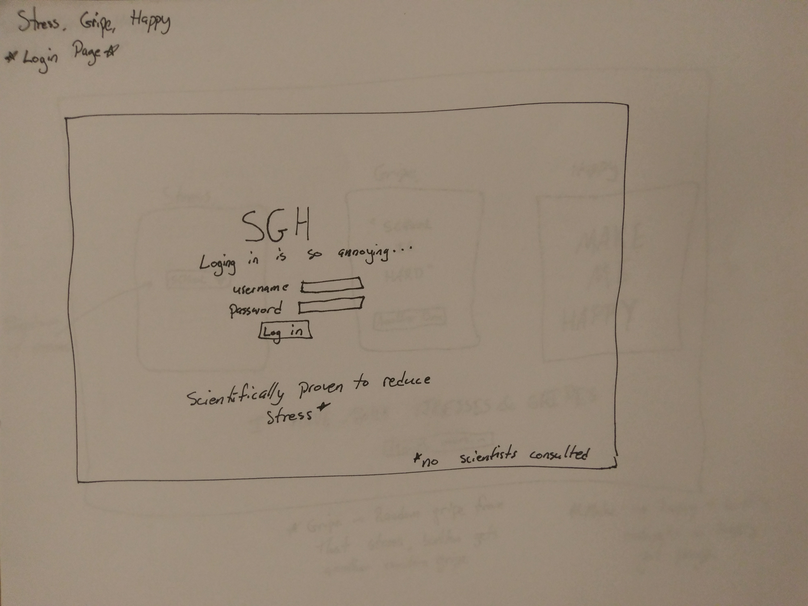
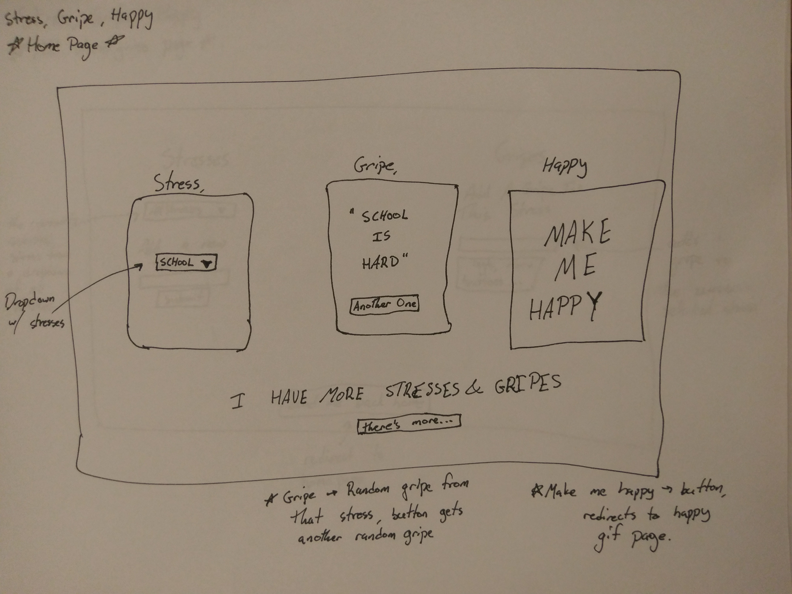
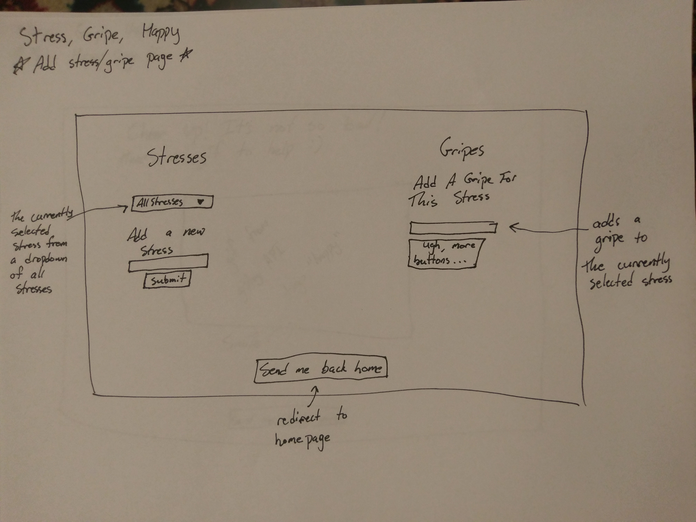
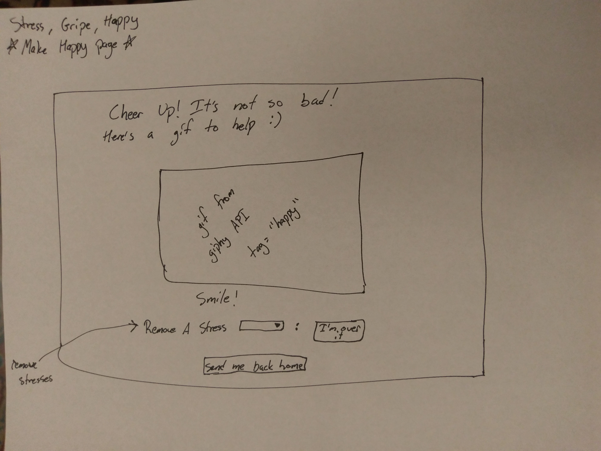

# Stress, Gripe, Happy

## Overview

School and work are hard, life is stressful, and complaining too much to friends can only end badly. Stress, Gripe, Happy is a platform that allows a user to upload their stresses, write as many gripes as they want for each of these stresses, and finally, find bliss and comfort in the form of happy gifs. Users can upload new stresses and gripes, see their old stresses and gripes, and click the "Make Me Happy" button in order to generate a random gif with the tag "happy".

Stress, Gripe, Happy uses the Giphy API to bring in gifs with the tag happy, and angluar.js to make it all look pretty.
<!-- 

For extensive docs go to: http://linserv2.cims.nyu.edu:15731/appDocs
 -->


## Data Model

The application will have a database that contains users, stresses, and gripes

* each user will have a username and password
    * the user will have a collection with stresses
    * each stress will have an array of gripes (with embedding)

### Sample Documents

An example user:

```javascript
{
  username: "frustration1",
  password: // a password hash
}
```

An example shema with Embedded stresses and gripes:

```javascript
{
  user: // a reference to a User object
  Stresses = {
     'homework' : {
                    'gripe1' : "I have way too much homework and I can't keep up",
                    'gripe2' : "I miss sleep",
                    'gripe3' : "Does the professor even know how to do this???"
                },

    'dating' : {
                    'gripe1' : "I'm undateable!",
                    'gripe2' : "Notice me, gosh!",
                    'gripe3' : "Dating is so time consuming"
                }
  }

}
```


## First Draft Schema (https://github.com/nyu-csci-ua-0480-007-fall-2017/djm552-final-project/blob/master/src/db.js)


## Wireframes

/login - login page for the site



/index - a page to stress and gripe



/add - a page to add stresses and gripes



/happy - a page with a random gif with the tag "happy", and where you can delete stresses



## Site map

   Login Page --- Signup Page<br>
      |<br>
      |<br>
      Homepage<br>
   |<br>
   |<br>
   Add Stresses/Gripes&emsp; /  &emsp;Make Happy (gifs)<br>


## User Stories or Use Cases

1. as non-registered user, I can register a new account with the site
2. as a user, I can log in to the site
3. as a user, I can add a stress
4. as a user, for each stress created, I can add gripes
5. as a user, I can view my stresses and gripes
6. as a user, I can click the "Make Me Happy" button to view a gif with the tag "happy"
7. as a user, I can remove and delete stresses

## Research Topics

Integrate user authentication - 5 points (using passport)

Giphy API (https://developers.Giphy.com/docs/) - 2 points
   * The Giphy API allows gifs from the Giphy library to appear on a different site. It has a number of use cases that allows gifs to be loaded in based on different inputs and variables
   * I will be using the Giphy API to load in gifs with the tag "happy" as a simple stress reliever.
   * I think the Giphy API is worth 2 points because I have never used it and I have very little experience using APIs in general. Getting the Giphy API to work is also central to my site.

Bootstrap - 2 points
   * Bootstrap is a css framework that makes sites very easy to organize and arrange. It also provides some build in styling for elements of a page
   * I will be using Bootstrap to ensure that my site looks clean and organized, and to make it responsive.

JSDoc (http://usejsdoc.org/) - 2 points
   * JSDoc creates a comprehensive documentation page that can be used by developers to understand how the program works. It uses special comments in the code to generate an html page with a breakdown of the functions that make the app function and will help with clear documentation


11 points total out of 8 required points


## [Initial Main Project File](https://github.com/nyu-csci-ua-0480-007-fall-2017/djm552-final-project/blob/master/src/app.js)


## Annotations / References Used

Amazing scotch.io reference for passport:
https://scotch.io/tutorials/easy-node-authentication-setup-and-local

To correctly display user specific schema from the database on the front-end:
https://stackoverflow.com/questions/16256193/how-to-post-and-get-data-unique-to-each-logged-in-user-with-express-and-mongoose

Reference for JSDoc:
http://usejsdoc.org/

JSDoc for Express Routes:
https://www.npmjs.com/package/jsdoc-route-plugin

Giphy API reference:
https://github.com/Giphy/giphy-js-sdk-core#setup

For Express 404 page:
https://stackoverflow.com/questions/6528876/how-to-redirect-404-errors-to-a-page-in-expressjs
